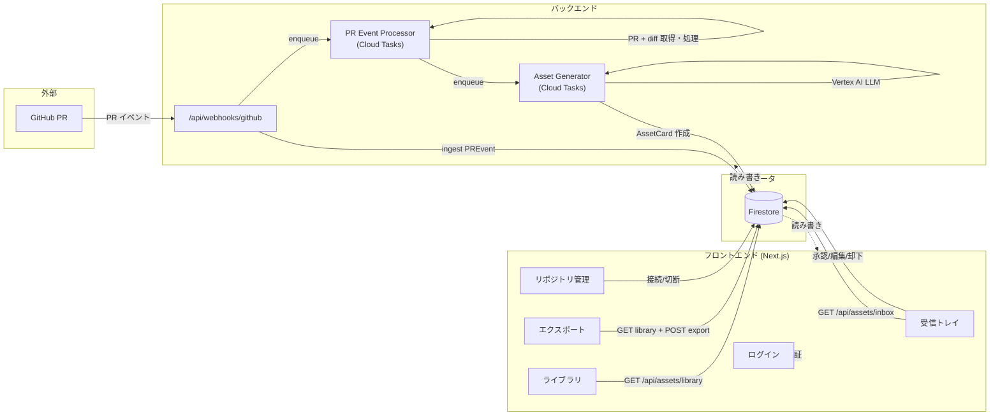
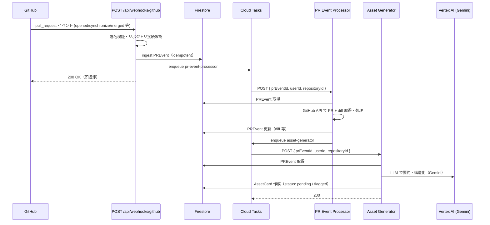
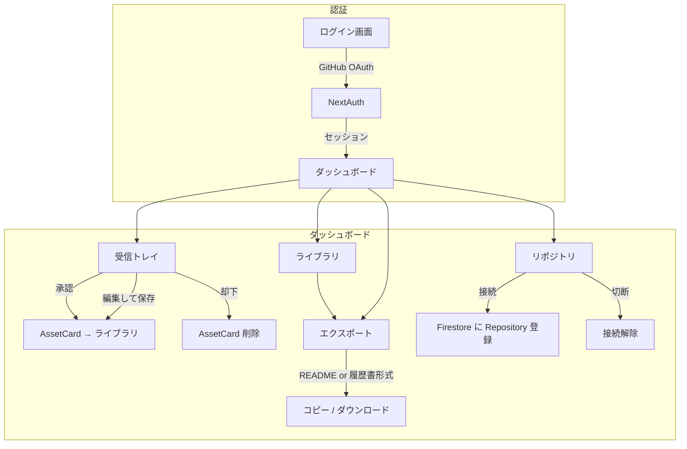
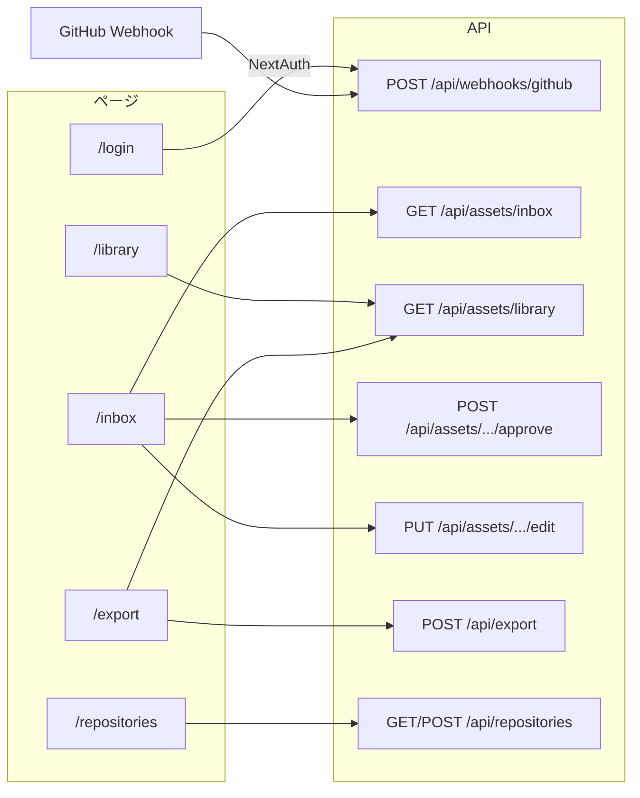
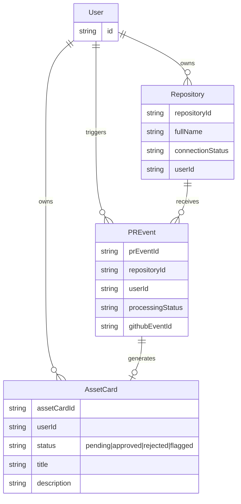

# WorkLog アプリ アーキテクチャ（Mermaid）

## 1. 全体の流れ（PR → AssetCard → ユーザー）

## 2. Webhook → AssetCard 生成のシーケンス

## 3. ユーザー操作フロー

## 4. 画面と API の対応

## 5. データモデル（概念）

---

- **Webhook**: PR イベントを受信後、即 200 を返し、処理は Cloud Tasks に委譲。
- **PR Event Processor**: PR と diff を取得し、Asset Generator 用タスクを enqueue。
- **Asset Generator**: Vertex AI（Gemini）で PR から AssetCard を生成し Firestore に保存。
- **フロント**: 受信トレイで承認/編集/却下、ライブラリで一覧・エクスポート、リポジトリで接続管理。
